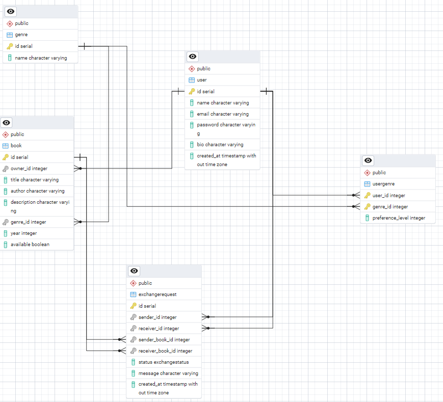

# Отчет по лабораторной работе 1
## Система обмена книгами на FastAPI

### Описание проекта
Система обмена книгами представляет собой REST API, построенное на FastAPI, которое позволяет пользователям регистрироваться, добавлять книги, создавать запросы на обмен и управлять жанрами. Система использует SQLModel для работы с базой данных и JWT для аутентификации.

### Архитектура системы

#### Основные компоненты:
- **FastAPI** - веб-фреймворк для создания API
- **SQLModel** - ORM для работы с базой данных
- **JWT** - аутентификация пользователей
- **bcrypt** - хеширование паролей
- **Alembic** - миграции базы данных

### Модели данных

#### Database ERD



#### 1. User (Пользователь)
```python
class User(SQLModel, table=True):
    id: Optional[int] = Field(default=None, primary_key=True)
    name: str
    email: str
    password: str
    bio: Optional[str] = None
    created_at: datetime = datetime.now()

    books: List["Book"] = Relationship(back_populates="owner")
    sent_requests: List["ExchangeRequest"] = Relationship(back_populates="sender")
    received_requests: List["ExchangeRequest"] = Relationship(back_populates="receiver")
    user_genres: List["UserGenre"] = Relationship(back_populates="user")
```

#### 2. Book (Книга)
```python
class Book(SQLModel, table=True):
    id: Optional[int] = Field(default=None, primary_key=True)
    owner_id: int = Field(foreign_key="user.id")
    title: str
    author: Optional[str] = None
    description: Optional[str] = None
    genre_id: Optional[int] = Field(default=None, foreign_key="genre.id")
    year: Optional[int] = None
    available: bool = True

    owner: Optional[User] = Relationship(back_populates="books")
    genre: Optional["Genre"] = Relationship(back_populates="books")
```

#### 3. Genre (Жанр)
```python
class Genre(SQLModel, table=True):
    id: Optional[int] = Field(default=None, primary_key=True)
    name: str

    books: List[Book] = Relationship(back_populates="genre")
    users: List["UserGenre"] = Relationship(back_populates="genre")
```

#### 4. UserGenre (Связь пользователь-жанр)
```python
class UserGenre(SQLModel, table=True):
    user_id: int = Field(foreign_key="user.id", primary_key=True)
    genre_id: int = Field(foreign_key="genre.id", primary_key=True)
    preference_level: Optional[int] = None

    user: Optional[User] = Relationship(back_populates="user_genres")
    genre: Optional[Genre] = Relationship(back_populates="users")
```

#### 5. ExchangeRequest (Запрос на обмен)
```python
class ExchangeRequest(SQLModel, table=True):
    id: Optional[int] = Field(default=None, primary_key=True)
    sender_id: int = Field(foreign_key="user.id")
    receiver_id: int = Field(foreign_key="user.id")
    sender_book_id: int = Field(foreign_key="book.id")
    receiver_book_id: int = Field(foreign_key="book.id")
    status: ExchangeStatus = ExchangeStatus.pending
    message: Optional[str] = None
    created_at: datetime = datetime.now()

    sender: Optional[User] = Relationship(back_populates="sent_requests")
    receiver: Optional[User] = Relationship(back_populates="received_requests")
    sender_book: Optional[Book] = Relationship()
    receiver_book: Optional[Book] = Relationship()
```

### Подключение к базе данных

#### Файл connection.py
```python
import os
from dotenv import load_dotenv
from sqlmodel import SQLModel, Session, create_engine

load_dotenv()
db_url = os.getenv('DB_URL')
engine = create_engine(db_url, echo=True)

def init_db():
    SQLModel.metadata.create_all(engine)

def get_session():
    with Session(engine) as session:
        yield session
```

### Система аутентификации

#### Файл auth.py
```python
class AuthHandler:
    security = HTTPBearer()
    pwd_context = CryptContext(schemes=['bcrypt'])
    secret = 'supersecret'

    def get_password_hash(self, password):
        return self.pwd_context.hash(password)

    def verify_password(self, pwd, hashed_pwd):
        return self.pwd_context.verify(pwd, hashed_pwd)

    def encode_token(self, user_id):
        payload = {
            'exp': datetime.datetime.utcnow() + datetime.timedelta(hours=8),
            'iat': datetime.datetime.utcnow(),
            'sub': user_id
        }
        return jwt.encode(payload, self.secret, algorithm='HS256')

    def decode_token(self, token):
        try:
            payload = jwt.decode(token, self.secret, algorithms=['HS256'])
            return payload['sub']
        except jwt.ExpiredSignatureError:
            raise HTTPException(status_code=401, detail='Expired signature')
        except jwt.InvalidTokenError:
            raise HTTPException(status_code=401, detail='Invalid token')

    def get_current_user(self, auth: HTTPAuthorizationCredentials = Security(security)):
        credentials_exception = HTTPException(
            status_code=status.HTTP_401_UNAUTHORIZED,
            detail='Could not validate credentials'
        )
        email = self.decode_token(auth.credentials)
        if email is None:
            raise credentials_exception
        user = find_user(email)
        if user is None:
            raise credentials_exception
        return user
```

### API Эндпоинты

#### 1. Пользователи (user_endpoints.py)

**POST /registration** - Регистрация нового пользователя
- Принимает: UserCreate (name, email, password, bio)
- Возвращает: JSON с сообщением об успешной регистрации
- Статус: 201 Created

**POST /login** - Вход в систему
- Принимает: UserLogin (email, password)
- Возвращает: JWT токен
- Статус: 200 OK

**GET /users/me** - Получение информации о текущем пользователе
- Требует: JWT токен
- Возвращает: UserRead
- Статус: 200 OK

**GET /users** - Получение списка всех пользователей
- Возвращает: List[UserRead]
- Статус: 200 OK

**POST /change-password** - Изменение пароля
- Требует: JWT токен
- Принимает: UserPasswordChange (old_password, new_password)
- Возвращает: JSON с сообщением об успешном изменении
- Статус: 200 OK

#### 2. Книги (book_endpoints.py)

**POST /books/** - Создание новой книги
- Требует: JWT токен
- Принимает: BookCreate
- Возвращает: BookRead
- Статус: 200 OK

**GET /books/** - Получение списка всех книг
- Возвращает: List[BookRead]
- Статус: 200 OK

**GET /books/{book_id}** - Получение книги по ID
- Принимает: book_id (int)
- Возвращает: BookRead
- Статус: 200 OK

**DELETE /books/{book_id}** - Удаление книги
- Принимает: book_id (int)
- Возвращает: {"ok": True}
- Статус: 200 OK

**PATCH /books/{book_id}** - Обновление книги
- Принимает: book_id (int), BookUpdate
- Возвращает: BookRead
- Статус: 200 OK

#### 3. Жанры (genre_endpoints.py)

**POST /genres/** - Создание нового жанра
- Принимает: GenreCreate
- Возвращает: GenreRead
- Статус: 200 OK

**GET /genres/** - Получение списка всех жанров
- Возвращает: List[GenreRead]
- Статус: 200 OK

**GET /genres/{genre_id}** - Получение жанра по ID
- Принимает: genre_id (int)
- Возвращает: GenreRead
- Статус: 200 OK

**DELETE /genres/{genre_id}** - Удаление жанра
- Принимает: genre_id (int)
- Возвращает: {"ok": True}
- Статус: 200 OK

**PATCH /genres/{genre_id}** - Обновление жанра
- Принимает: genre_id (int), GenreUpdate
- Возвращает: GenreRead
- Статус: 200 OK

#### 4. Связи пользователь-жанр (user_genre_endpoints.py)

**POST /user/genres/** - Создание связи пользователь-жанр
- Принимает: UserGenreCreate
- Возвращает: UserGenreRead
- Статус: 200 OK

**GET /user/genres/** - Получение всех связей пользователь-жанр
- Возвращает: List[UserGenreRead]
- Статус: 200 OK

**GET /user/genres/user/{user_id}** - Получение жанров пользователя
- Принимает: user_id (int)
- Возвращает: List[UserGenreRead]
- Статус: 200 OK

**DELETE /user/genres/user/{user_id}/genre/{genre_id}** - Удаление связи
- Принимает: user_id (int), genre_id (int)
- Возвращает: {"ok": True}
- Статус: 200 OK

**PATCH /user/genres/user/{user_id}/genre/{genre_id}** - Обновление связи
- Принимает: user_id (int), genre_id (int), UserGenreUpdate
- Возвращает: UserGenreRead
- Статус: 200 OK

#### 5. Запросы на обмен (exchange_endpoints.py)

**POST /requests/** - Создание запроса на обмен
- Принимает: ExchangeRequestCreate
- Возвращает: ExchangeRequestRead
- Статус: 200 OK

**GET /requests/** - Получение всех запросов на обмен
- Возвращает: List[ExchangeRequestRead]
- Статус: 200 OK

**GET /requests/{exchange_id}** - Получение запроса по ID
- Принимает: exchange_id (int)
- Возвращает: ExchangeRequestRead
- Статус: 200 OK

**DELETE /requests/{exchange_id}** - Удаление запроса
- Принимает: exchange_id (int)
- Возвращает: {"ok": True}
- Статус: 200 OK

**PATCH /requests/{exchange_id}/status** - Обновление статуса запроса
- Принимает: exchange_id (int), status (str)
- Возвращает: ExchangeRequestRead
- Статус: 200 OK

### Главный файл приложения

#### main.py
```python
from contextlib import asynccontextmanager
import uvicorn
from fastapi import FastAPI

from db.connection import init_db
from endpoints.book_endpoints import book_router
from endpoints.exchange_endpoints import exchange_router
from endpoints.genre_endpoints import genre_router
from endpoints.user_endpoints import user_router
from endpoints.user_genre_endpoints import user_genre_router

@asynccontextmanager
async def lifespan(app: FastAPI):
    init_db()
    yield

app = FastAPI(lifespan=lifespan)

app.include_router(user_router)
app.include_router(genre_router, prefix="/genres", tags=["genres"])
app.include_router(book_router, prefix="/books", tags=["books"])
app.include_router(user_genre_router, prefix="/user/genres", tags=["user genres"])
app.include_router(exchange_router, prefix="/requests", tags=["exchange requests"])

if __name__ == '__main__':
    uvicorn.run('main:app', host="localhost", port=8000, reload=True)
```

### Схемы данных (Pydantic модели)

Система использует Pydantic схемы для валидации входных и выходных данных:

- **UserCreate** - для создания пользователя
- **UserLogin** - для входа в систему
- **UserRead** - для чтения данных пользователя
- **UserPasswordChange** - для изменения пароля
- **BookCreate/BookRead/BookUpdate** - для работы с книгами
- **GenreCreate/GenreRead/GenreUpdate** - для работы с жанрами
- **UserGenreCreate/UserGenreRead/UserGenreUpdate** - для связей пользователь-жанр
- **ExchangeRequestCreate/ExchangeRequestRead** - для запросов на обмен

### Запуск приложения

1. Установить зависимости: `pip install -r requirements.txt`
2. Настроить переменную окружения `DB_URL` в файле `.env`
3. Запустить приложение: `python main.py`
4. API будет доступно по адресу: `http://localhost:8000`
5. Документация API доступна по адресу: `http://localhost:8000/docs`

### Особенности реализации

1. **Безопасность**: Использование JWT токенов и хеширование паролей с помощью bcrypt
2. **Валидация данных**: Pydantic схемы для автоматической валидации
3. **Связи между таблицами**: Правильно настроенные foreign keys и relationships
4. **Обработка ошибок**: HTTPException для корректной обработки ошибок
5. **Документация**: Автоматическая генерация OpenAPI документации
6. **Миграции**: Использование Alembic для управления схемой базы данных
